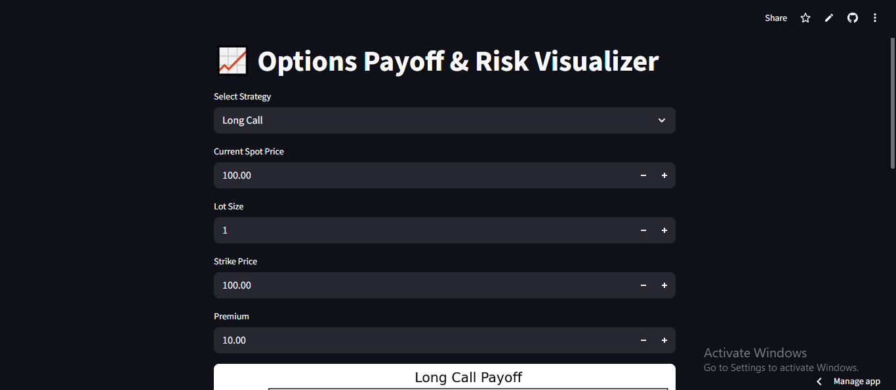
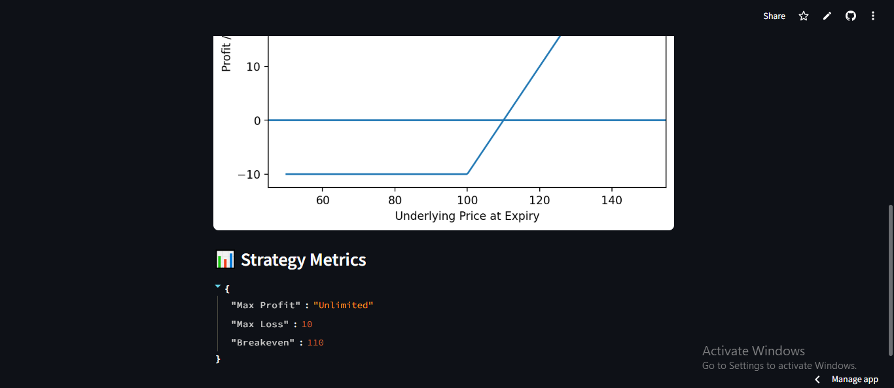

# Options-Payoff-Risk-Visualizer
An interactive Python application that models payoff structures of common derivatives strategies and visualizes risk-reward asymmetry at expiration.

Features:
- Long Call / Put
- Short Call / Put
- Straddle
- Strangle
- Lot size adjustment
- Breakeven computation
- Max profit / max loss display
- Interactive visualization using Streamlit

Developed an interactive Options Payoff & Risk Visualizer modeling nonlinear derivatives strategies. analyzed breakeven dynamics and asymmetric exposure using Python and NumPy.

## 📷 Application Preview

